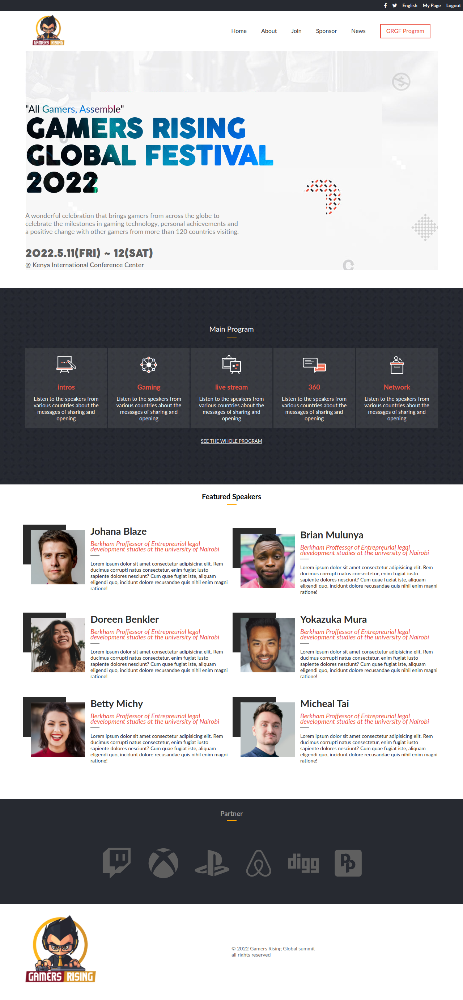

# Gamers Rising Global Fevstival 2022

> This is a version of an Imaginary website for a gaming festival I developed as part of my capstone project for the Microverse program module 1. The website is for an upcoming gaming festival for Gamers Rising, an extreme gaming gaming company that is having their first event in Africa here in Kenya.



## Built With

- HTML
- Pure CSS
- Vanilla JavaScript
- Github
- LightHouse
- Webhint
- Stylelint
- EsLint
## Live Demo (if available)

[Live Demo Link](https://livedemo.com)


 Getting Started

#### Cloning the project
```
git clone  https://github.com/daudi13/devfest <Your-Build-Directory>
```

## Getting packages and debuging with Stylelint
```
npm install --save-dev stylelint@13.x stylelint-scss@3.x stylelint-config-standard@21.x stylelint-csstree-validator@1.x
```
##### For validation detection using Stylelint Run
```
npx stylelint "**/*.{css,scss}"
```
##### from parent source directory

## Getting packages and debuging with ESlint
```
npm install npm install --save-dev eslint@7.x eslint-config-airbnb-base@14.x eslint-plugin-import@2.x babel-eslint@10.x
```
##### For validation detection using Stylelint Run
```
npx eslint .
```
##### from parent source directory

## Getting packages and debuging with Webhint
```
npm init -y
npm install --save-dev hint@6.x
```
##### For validation detection using Webhint Run
```
npx hint .

## Authors

👤 **David Ouma**

- GitHub: [@daudi13](https://github.com/daudi13)
- Twitter: [@davouma](https://twitter.com/davouma)
- LinkedIn: [david-ouma](https://linkedin.com/in/david-ouma)


## 🤝 Contributing
Feel free to check the [issues page](../../issues/).
Original design idea by Cindy Shin

## Show your support

Give a ⭐️ if you like this project!

## Acknowledgments
Original design idea by [Cindy Shin in Behance](https://www.behance.net/adagio07)

## 📝 License

This project is [MIT](./MIT.md) licensed.